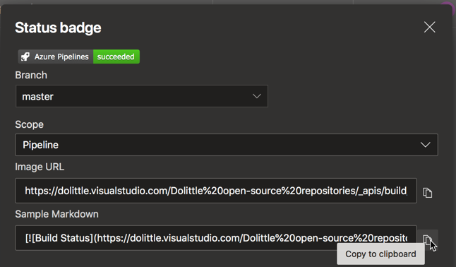

Azure DevOps has a Build badge that we typically want to make puplic at the top of the
repository's `README.md` file. The markdown code for this can be found by clicking the
menu to the right:

With the popup, you can then copy the markdown code to your clipboard:

Put what you have in the clipboard into your `README.md`.
