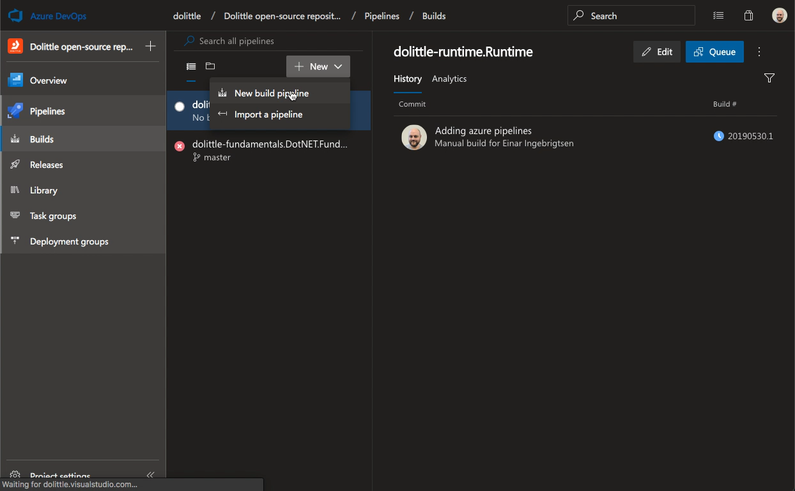

When the pipeline is in place, we want to hook this up in Azure DevOps.
Note: You'll need to be authorized in the organization in order to do this.

Navigate to your organization, for instance for Dolittle open-source projects, that would
be [this](https://dev.azure.com/dolittle/Dolittle%20open-source%20repositories).

Add a build pipeline:

Select GitHub as the source of the code:

Find the repository you're hooking up:

Verify that the suggestion is correct for the repository or select the correct repository and then
grant Azure DevOps access and install.

Verify that it is the pipeline you're expecting:

Here is a full video:

