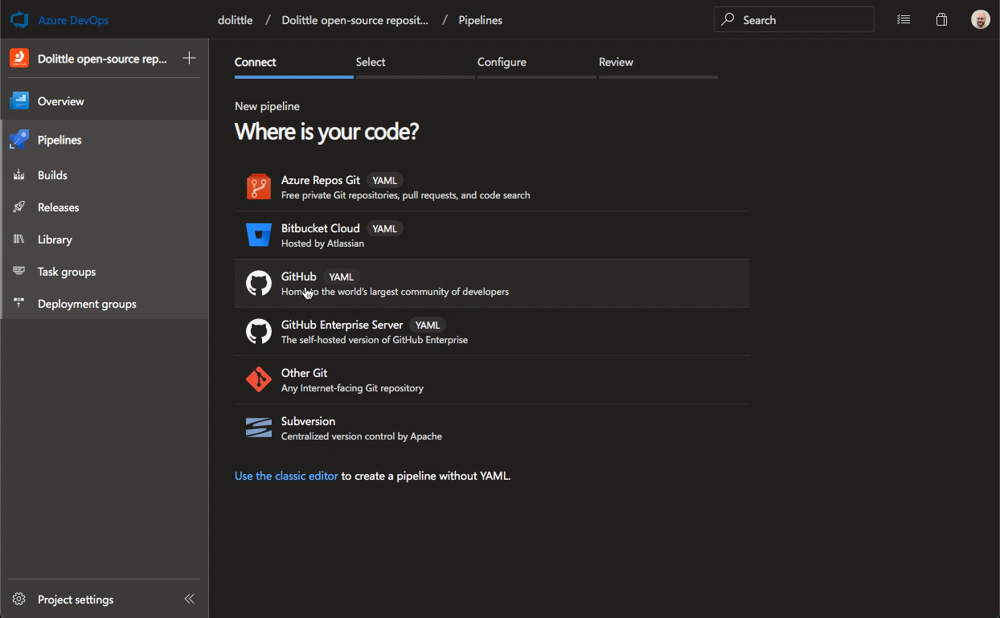
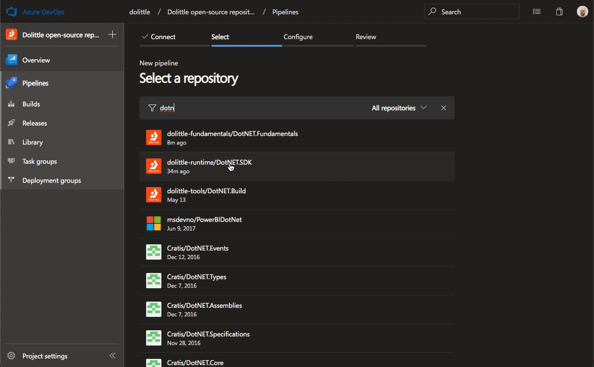

# Build

## Setting up Azure Pipelines in a new project

Start by adding a file called `azure-pipelines.yml` at the root of the
repository you want to use.

```yaml
trigger:
- master

resources:
  repositories:
    - repository: templates
      type: github
      name: dolittle-tools/Build
      endpoint: dolittle-tools

jobs:
- template: dotnet-framework.yml@templates
```

As you can see, the file refer to a job template. You'll find the different
available templates in this repository.

### Cascades

It is possible to cascade to a pipeline for another project. This feature is
basically to make versioning for things like NuGet to work properly and guarantee
that the correct versions are being used when one project is dependent on the other.
This might not be important to you, but for some of the Dolittle projects, this is
vital - as we rely on wildcard for minor and patch in versioning and trust our own
commitment to [versioning](https://dolittle.io/contributing/guidelines/versioning/).

You simply add a parameter called `CASCADES`to the job, this can hold one or more
projects to cascade to - space separated. The format is [GitHub Organization]/[Repository].

```yaml
jobs:
- template: dotnet-framework.yml@templates
  parameters:
    CASCADES: dolittle-runtime/DotNET.SDK
```

### Build Badge

Azure DevOps has a Build badge that we typically want to make puplic at the top of the
repository's `README.md` file. The markdown code for this can be found by clicking the
menu to the right:


With the popup, you can then copy the markdown code to your clipboard:


Put what you have in the clipboard into your `README.md`.

### Installing in Azure DevOps

When the pipeline is in place, we want to hook this up in Azure DevOps.
Note: You'll need to be authorized in this organization in order to do this.

Navigate to the [project in Azure DevOps](https://dev.azure.com/dolittle/Dolittle%20open-source%20repositories).

Add a build pipeline:


Select GitHub as the source of the code:



Find the repository you're hooking up:



Verify that the suggestion is correct for the repository or select the correct repository and then
grant Azure DevOps access and install.


Verify that it is the pipeline you're expecting:


Here is a full video:


